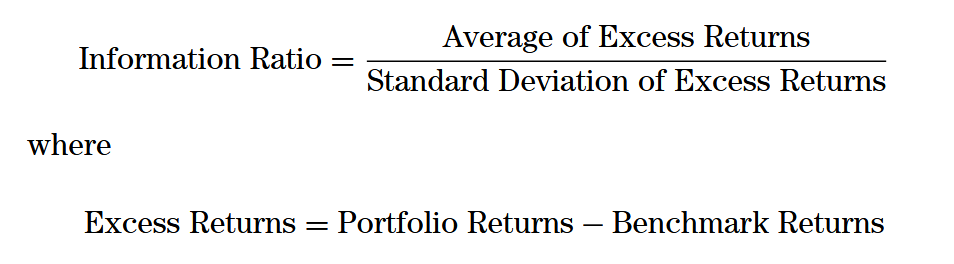
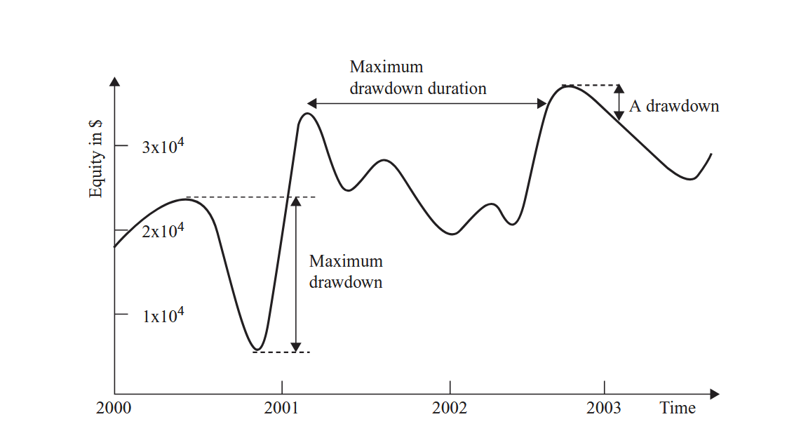

# How to Evaluate Trading Strategies

Once you've found a promising trading strategy online. It's been backtested by the write and the results look great. Before you commit your time and capital, it's crucial to do some quick evaluation on the code evaluation

## Core Evaluation Metrics

Some fundamental questions you need to ask about any strategy are:

### 1.  **Performance:** How do its returns compare against standard market benchmarks (like the S&P 500)? 
A winning strategy should consistently outperform a simple buy-and-hold approach.

#### The Sharpe Ratio: Measuring Risk-Adjusted Return

While raw returns are important, they don't tell the whole story. You need to know if the returns are worth the risk taken. This is where the **Sharpe Ratio** comes in. It measures the performance of an investment compared to a risk-free asset, after adjusting for its risk.

### 2.  **Risk:** How significant are the drawdowns? 
A drawdown is the peak-to-trough decline during a specific period. Deep or prolonged drawdowns are gut wrenching in reality. You need to always ask yourself can I bear a loss worth of 50% for 3 months. Am I mentally prepared for that?

#### Several factors influence a strategy's Sharpe Ratio:

*   **Trading Frequency:** If a strategy trades infrequently (only a few times a year), the sample size is small, making it difficult to achieve a statistically significant (and thus high) Sharpe Ratio.
*   **Drawdowns:** Strategies with high or lengthy drawdowns are inherently riskier, which will result in a lower Sharpe Ratio.

#### Sharpe Ratio: A Rule of Thumb

The Sharpe Ratio provides a standardized way to compare different strategies. Here's a general guideline for interpreting annualized Sharpe Ratios:

*   **< 1.0:** Generally not considered a good stand-alone strategy.
*   **> 2.0:** Typically indicates a strategy that is profitable on a monthly basis.
*   **> 3.0:** Suggests a very strong strategy that is profitable on an almost daily basis.

## Conclusion
The document is incomplete as I'm still reading about the topic myself. I did some searching on these facts and why they happen and tried to well document it. Till now what we know is that by analyzing returns, drawdowns, and the Sharpe Ratio, you can make a more informed decision about whether a trading strategy aligns with your risk tolerance and investment goals.

